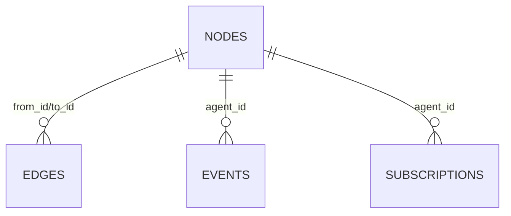

# Remora v2 — Final Implementation Guide

**Date**: 2026-03-14
**Source**: FINAL_REVIEW.md §11 Recommendations & Next Steps
**Scope**: Step-by-step implementation instructions for all 17 recommendations

---

## Table of Contents

1. **[P1-1: SSE Reconnection Logic](#p1-1-sse-reconnection-logic)** — Add automatic reconnection with last-event-ID tracking to the web UI's EventSource.

2. **[P1-2: Type-Annotate Web Server Parameters](#p1-2-type-annotate-web-server-parameters)** — Replace `Any` types on `create_app()` with concrete imports.

3. **[P1-3: Graceful Shutdown](#p1-3-graceful-shutdown)** — Add clean shutdown for SSE streams and actor pool with in-flight turn completion.

4. **[P1-4: Reconciler Mtime Cleanup](#p1-4-reconciler-mtime-cleanup)** — (Already implemented — verification note.)

5. **[P2-5: Structured Logging with Correlation IDs](#p2-5-structured-logging-with-correlation-ids)** — Add correlation context to actor turn logs for traceability.

6. **[P2-6: Basic Metrics](#p2-6-basic-metrics)** — Add counters for agent turns, event throughput, queue depths, and cache hit rates.

7. **[P2-7: Health Endpoint](#p2-7-health-endpoint)** — Add `/api/health` returning system status.

8. **[P3-8: Rate Limiting on `/api/chat`](#p3-8-rate-limiting-on-apichat)** — Add sliding window rate limiter to prevent chat flood.

9. **[P3-9: Agent Output Size Limits](#p3-9-agent-output-size-limits)** — Truncate oversized agent responses before storage.

10. **[P3-10: SQLite Connection Sharing](#p3-10-sqlite-connection-sharing)** — Ensure components share a single database connection.

11. **[P4-11: Review-Agent & Test-Agent Tool Scripts](#p4-11-review-agent--test-agent-tool-scripts)** — Create functional tool scripts for the review and test agent bundles.

12. **[P4-12: Agent Conversation Viewer](#p4-12-agent-conversation-viewer)** — Add conversation history panel to web UI.

13. **[P4-13: Event Timeline Visualization](#p4-13-event-timeline-visualization)** — Add chronological event view to web UI.

14. **[P4-14: Multi-Project Support](#p4-14-multi-project-support)** — Enable monitoring multiple codebases from a single instance.

15. **[P5-15: User Guide](#p5-15-user-guide)** — Write comprehensive user documentation.

16. **[P5-16: External Function API Reference](#p5-16-external-function-api-reference)** — Document the 24 TurnContext functions for bundle authors.

17. **[P5-17: Architecture Documentation](#p5-17-architecture-documentation)** — Create architecture docs with data flow diagrams.

---


## P1-1: SSE Reconnection Logic

**Priority**: 1 (Hardening)
**Files**: `src/remora/web/static/index.html`, `src/remora/web/server.py`
**Estimated Scope**: ~40 lines JS, ~5 lines Python

### Problem

The web UI creates an `EventSource` for SSE streaming but has no reconnection logic. If the connection drops (server restart, network hiccup), the UI goes silent with no feedback.

### Implementation Steps

#### Step 1: Add event ID to SSE messages (server-side)

In `src/remora/web/server.py`, modify the `sse_stream` function to include `id:` fields in SSE messages. The event store's auto-increment `id` is the natural choice.

**In the replay section** (around line 134), add an `id:` line using the event row's `id` field:

```python
# In the replay loop:
for row in reversed(rows):
    event_name = row.get("event_type", "Event")
    event_id = row.get("id", "")
    replay_payload = {
        "event_type": event_name,
        "timestamp": row.get("timestamp"),
        "correlation_id": row.get("correlation_id"),
        "payload": row.get("payload", {}),
    }
    payload_text = json.dumps(replay_payload, separators=(",", ":"))
    yield f"id: {event_id}\nevent: {event_name}\ndata: {payload_text}\n\n"
```

**In the live stream section** (around line 147), the `Event` base class doesn't have a sequential ID. Two options:

- **Option A** (simple): Use the event's timestamp as the ID:
  ```python
  yield f"id: {event.timestamp}\nevent: {event.event_type}\ndata: {payload}\n\n"
  ```

- **Option B** (better): Pass the `event_id` returned by `EventStore.append()` through to the bus. This requires adding an `event_id` field to the `Event` base class that gets set after persistence. More invasive but provides true last-event-ID tracking.

**Recommendation**: Start with Option A. It's sufficient for reconnection. Upgrade to Option B later if exact deduplication is needed.

#### Step 2: Add `Last-Event-ID` support to the server

In `sse_stream`, read the `Last-Event-ID` header from the request and use it to determine the replay starting point:

```python
async def sse_stream(request: Request) -> StreamingResponse:
    last_event_id = request.headers.get("Last-Event-ID")
    # ... existing once/replay_limit logic ...

    async def event_generator():
        yield ": connected\n\n"
        if last_event_id:
            # Replay events after the last seen ID
            rows = await event_store.get_events_after(last_event_id)
            for row in rows:
                # ... emit replay events with id: field ...
        elif replay_limit > 0:
            # ... existing replay logic ...
```

This requires adding a `get_events_after(event_id)` method to `EventStore`:

```python
async def get_events_after(self, after_id: str, limit: int = 500) -> list[dict[str, Any]]:
    """Get events after a given ID for SSE reconnection."""
    try:
        numeric_id = int(after_id)
    except (TypeError, ValueError):
        return []
    cursor = await self._db.execute(
        "SELECT * FROM events WHERE id > ? ORDER BY id ASC LIMIT ?",
        (numeric_id, limit),
    )
    rows = await cursor.fetchall()
    result = [dict(row) for row in rows]
    for row in result:
        row["payload"] = json.loads(row["payload"])
    return result
```

#### Step 3: Add reconnection logic to the web UI

In `src/remora/web/static/index.html`, replace the bare `EventSource` with a reconnecting wrapper:

```javascript
function createEventSource() {
    const es = new EventSource('/sse?replay=50');

    es.onopen = () => {
        console.log('SSE connected');
        document.getElementById('connection-status')?.classList.remove('disconnected');
    };

    es.onerror = (err) => {
        console.warn('SSE connection error, will reconnect...');
        document.getElementById('connection-status')?.classList.add('disconnected');
        // EventSource auto-reconnects by default, but if it closes:
        if (es.readyState === EventSource.CLOSED) {
            setTimeout(() => createEventSource(), 2000);
        }
    };

    // ... existing event handlers ...
    return es;
}
```

Note: The browser's `EventSource` already has built-in reconnection with automatic `Last-Event-ID` header sending. The main work is on the server side to honor that header. On the client side, the primary addition is visual feedback (connection status indicator).

#### Step 4: Add a connection status indicator

Add a small status dot to the UI header:

```html
<span id="connection-status" class="connected" title="SSE connection status">●</span>
```

```css
#connection-status.connected { color: #4caf50; }
#connection-status.disconnected { color: #f44336; animation: pulse 1s infinite; }
```

### Tests

Add to `tests/unit/test_web_server.py`:

1. `test_sse_includes_event_id` — Verify SSE replay messages include `id:` field
2. `test_sse_last_event_id_header` — Verify server honors `Last-Event-ID` and replays from that point
3. `test_get_events_after` — Unit test for the new `EventStore.get_events_after()` method

---


## P1-2: Type-Annotate Web Server Parameters

**Priority**: 1 (Hardening)
**Files**: `src/remora/web/server.py`
**Estimated Scope**: ~5 lines changed

### Problem

`create_app()` accepts `event_store: Any`, `node_store: Any`, `event_bus: Any`. This defeats IDE autocompletion and type checking.

### Implementation

Replace the `Any` imports with concrete types:

```python
# Before:
from typing import Any

def create_app(
    event_store: Any,
    node_store: Any,
    event_bus: Any,
) -> Starlette:

# After:
from remora.core.events.bus import EventBus
from remora.core.events.store import EventStore
from remora.core.graph import NodeStore

def create_app(
    event_store: EventStore,
    node_store: NodeStore,
    event_bus: EventBus,
) -> Starlette:
```

Remove the `from typing import Any` import if no longer used elsewhere in the file.

### Tests

Existing tests should continue passing. No new tests needed — this is a type annotation change only. Run `devenv shell -- pytest tests/unit/test_web_server.py` to verify.

---

## P1-3: Graceful Shutdown

**Priority**: 1 (Hardening)
**Files**: `src/remora/__main__.py`, `src/remora/core/runner.py`, `src/remora/web/server.py`
**Estimated Scope**: ~30 lines

### Problem

When the process receives SIGINT/SIGTERM:
1. Active SSE connections are abandoned (clients see a dropped connection)
2. Actors in mid-turn may be cancelled abruptly
3. The web server shutdown and actor pool shutdown are not coordinated

### Current State

`__main__.py` already has a `finally` block (lines 225-248) that:
- Sets `web_server.should_exit = True`
- Cancels all tasks
- Calls `services.close()`
- Awaits `asyncio.gather(*tasks, return_exceptions=True)`

`ActorPool` already has `stop_and_wait()` which stops actors and waits for completion.

### Implementation Steps

#### Step 1: Use `stop_and_wait()` before cancelling tasks

In `__main__.py`, modify the `finally` block to gracefully stop the actor pool before cancelling tasks:

```python
finally:
    # 1. Stop accepting new work
    services.reconciler.stop()

    # 2. Wait for actors to finish current turns (with timeout)
    try:
        await asyncio.wait_for(services.runner.stop_and_wait(), timeout=10.0)
    except asyncio.TimeoutError:
        logger.warning("Actor pool did not drain within 10s, forcing shutdown")

    # 3. Signal web server to stop
    if web_server is not None:
        web_server.should_exit = True

    # 4. Close services (DB, etc.)
    await services.close()

    # 5. Cancel remaining tasks
    for task in tasks:
        if not task.done():
            task.cancel()
    await asyncio.gather(*tasks, return_exceptions=True)
```

#### Step 2: Add shutdown event for SSE clients

In `web/server.py`, add a shutdown signal that the SSE generator can check:

```python
def create_app(
    event_store: EventStore,
    node_store: NodeStore,
    event_bus: EventBus,
) -> Starlette:
    shutdown_event = asyncio.Event()

    async def sse_stream(request: Request) -> StreamingResponse:
        # ... existing setup ...
        async def event_generator():
            yield ": connected\n\n"
            # ... replay logic ...
            if once:
                return
            async with event_bus.stream() as stream:
                async for event in stream:
                    if await request.is_disconnected() or shutdown_event.is_set():
                        break
                    # ... emit event ...
            # Send a final comment so the client knows the server is closing
            yield ": server-shutdown\n\n"

    async def on_shutdown():
        shutdown_event.set()

    # ... routes ...
    app = Starlette(routes=routes, on_shutdown=[on_shutdown])
```

### Tests

Add to `tests/unit/test_web_server.py`:
1. `test_sse_stream_stops_on_shutdown` — Verify SSE generator exits when shutdown event is set

---

## P1-4: Reconciler Mtime Cleanup

**Priority**: 1 (Hardening)
**Status**: **ALREADY IMPLEMENTED** — No action needed.

### Verification

The original FINAL_REVIEW.md identified this as an issue, but upon closer inspection of `code/reconciler.py` line 92:

```python
# In reconcile_cycle(), for deleted paths:
for file_path in deleted_paths:
    _mtime, node_ids = self._file_state[file_path]
    for node_id in sorted(node_ids):
        await self._remove_node(node_id)
    self._file_state.pop(file_path, None)  # ← Cleanup happens here
```

The `_file_state` dict entries are properly cleaned up when files are deleted. The field is named `_file_state` (not `_file_mtimes` as originally described). No changes needed.

---


## P2-5: Structured Logging with Correlation IDs

**Priority**: 2 (Observability)
**Files**: `src/remora/core/actor.py`
**Estimated Scope**: ~20 lines

### Problem

Log messages from actor turns don't carry consistent structured context. When multiple actors are running concurrently, it's hard to trace which log lines belong to which agent turn.

### Current State

`actor.py` already generates a `correlation_id = str(uuid.uuid4())` per turn (in `_execute_turn`). Log messages use ad-hoc formatting like:
```python
logger.info("Executing turn for %s (depth=%d)", self._node_id, self._depth)
```

### Implementation

#### Step 1: Create a LoggerAdapter with turn context

Add a helper that creates a `logging.LoggerAdapter` with structured extra fields:

```python
# In actor.py, at module level:
def _turn_logger(
    node_id: str,
    correlation_id: str,
    turn_number: int,
) -> logging.LoggerAdapter:
    """Create a logger adapter with per-turn context fields."""
    return logging.LoggerAdapter(
        logger,
        {
            "node_id": node_id,
            "correlation_id": correlation_id,
            "turn": turn_number,
        },
    )
```

#### Step 2: Use the adapter in `_execute_turn`

At the start of `_execute_turn`, create the adapter and use it for all logging within the turn:

```python
async def _execute_turn(self, triggers: list[Trigger]) -> None:
    correlation_id = str(uuid.uuid4())
    turn_log = _turn_logger(self._node_id, correlation_id, self._depth)
    turn_log.info("Starting turn with %d triggers", len(triggers))
    # ... use turn_log instead of logger for all messages in this method ...
```

#### Step 3: Update log format in CLI

In `__main__.py`'s `_configure_logging`, update the format string to include the extra fields when present:

```python
fmt = "%(asctime)s %(levelname)s %(name)s [%(node_id)s:%(turn)s] %(message)s"
```

Or use a custom `logging.Filter` that injects defaults for non-actor log messages:

```python
class ContextFilter(logging.Filter):
    def filter(self, record):
        if not hasattr(record, 'node_id'):
            record.node_id = '-'
            record.correlation_id = '-'
            record.turn = '-'
        return True
```

### Tests

Add to `tests/unit/test_actor.py`:
1. `test_turn_logs_include_correlation_id` — Capture log output during a turn and verify correlation_id appears

---

## P2-6: Basic Metrics

**Priority**: 2 (Observability)
**Files**: New file `src/remora/core/metrics.py`, modifications to `actor.py`, `runner.py`, `events/store.py`, `workspace.py`
**Estimated Scope**: ~80 lines new + ~20 lines modifications

### Problem

No way to observe system health at a glance: how many turns have run, how many events have been emitted, how many agents are active, whether the workspace cache is effective.

### Implementation

#### Step 1: Create a simple metrics collector

Create `src/remora/core/metrics.py`:

```python
"""Simple in-memory metrics collector."""

from __future__ import annotations

import time
from dataclasses import dataclass, field


@dataclass
class Metrics:
    """Counters and gauges for system observability."""

    # Counters (monotonically increasing)
    agent_turns_total: int = 0
    agent_turns_failed: int = 0
    events_emitted_total: int = 0
    workspace_provisions_total: int = 0
    workspace_cache_hits: int = 0

    # Gauges (current values)
    active_actors: int = 0
    pending_inbox_items: int = 0

    # Timing
    start_time: float = field(default_factory=time.time)

    @property
    def uptime_seconds(self) -> float:
        return time.time() - self.start_time

    @property
    def cache_hit_rate(self) -> float:
        total = self.workspace_provisions_total + self.workspace_cache_hits
        return self.workspace_cache_hits / total if total > 0 else 0.0

    def snapshot(self) -> dict:
        """Return a JSON-serializable snapshot of all metrics."""
        return {
            "agent_turns_total": self.agent_turns_total,
            "agent_turns_failed": self.agent_turns_failed,
            "events_emitted_total": self.events_emitted_total,
            "workspace_provisions_total": self.workspace_provisions_total,
            "workspace_cache_hits": self.workspace_cache_hits,
            "workspace_cache_hit_rate": round(self.cache_hit_rate, 3),
            "active_actors": self.active_actors,
            "pending_inbox_items": self.pending_inbox_items,
            "uptime_seconds": round(self.uptime_seconds, 1),
        }
```

#### Step 2: Wire metrics into components

Pass a shared `Metrics` instance through `RuntimeServices` to the components that need it:

- **`actor.py`**: Increment `agent_turns_total` on turn completion, `agent_turns_failed` on error
- **`runner.py`**: Update `active_actors` gauge on actor creation/eviction
- **`events/store.py`**: Increment `events_emitted_total` on `append()`
- **`workspace.py`**: Increment `workspace_provisions_total` or `workspace_cache_hits` in `CairnWorkspaceService`

Each integration point is 1-2 lines:
```python
# In actor.py _execute_turn completion:
if self._metrics:
    self._metrics.agent_turns_total += 1

# In runner.py get_or_create_actor:
if self._metrics:
    self._metrics.active_actors = len(self._actors)
```

### Tests

Add `tests/unit/test_metrics.py`:
1. `test_metrics_snapshot` — Verify `snapshot()` returns expected keys
2. `test_cache_hit_rate_calculation` — Verify edge cases (0/0, all hits, no hits)

---

## P2-7: Health Endpoint

**Priority**: 2 (Observability)
**Files**: `src/remora/web/server.py`
**Estimated Scope**: ~20 lines
**Depends on**: P2-6 (Metrics)

### Problem

No programmatic way to check if the Remora instance is running and healthy. Useful for monitoring, orchestration, and debugging.

### Implementation

#### Step 1: Add `/api/health` route

In `web/server.py`, add a `Metrics` parameter to `create_app` and a health endpoint:

```python
def create_app(
    event_store: EventStore,
    node_store: NodeStore,
    event_bus: EventBus,
    metrics: Metrics | None = None,
) -> Starlette:

    async def api_health(_request: Request) -> JSONResponse:
        node_count = len(await node_store.list_nodes())
        health = {
            "status": "ok",
            "version": "0.5.0",
            "nodes": node_count,
        }
        if metrics:
            health["metrics"] = metrics.snapshot()
        return JSONResponse(health)

    routes = [
        # ... existing routes ...
        Route("/api/health", endpoint=api_health),
    ]
```

#### Step 2: Pass metrics from CLI

In `__main__.py`, create a `Metrics` instance and pass it through:

```python
from remora.core.metrics import Metrics

metrics = Metrics()
# Pass to services, actors, etc.
web_app = create_app(services.event_store, services.node_store, services.event_bus, metrics=metrics)
```

### Tests

Add to `tests/unit/test_web_server.py`:
1. `test_health_endpoint_returns_ok` — Verify `/api/health` returns 200 with `status: "ok"`
2. `test_health_endpoint_includes_metrics` — Verify metrics snapshot is included when metrics are provided

---


## P3-8: Rate Limiting on `/api/chat`

**Priority**: 3 (Robustness)
**Files**: `src/remora/web/server.py`
**Estimated Scope**: ~25 lines

### Problem

The `/api/chat` endpoint accepts messages without rate limiting. A misbehaving client (or fast-typing user) could flood the system with messages, each triggering agent activation and LLM calls.

### Implementation

#### Step 1: Add a simple sliding window rate limiter

Implement a lightweight in-process rate limiter (no external dependencies):

```python
import time
from collections import deque

class RateLimiter:
    """Simple sliding window rate limiter."""

    def __init__(self, max_requests: int = 10, window_seconds: float = 60.0):
        self._max = max_requests
        self._window = window_seconds
        self._timestamps: deque[float] = deque()

    def allow(self) -> bool:
        now = time.time()
        # Remove timestamps outside the window
        while self._timestamps and self._timestamps[0] < now - self._window:
            self._timestamps.popleft()
        if len(self._timestamps) >= self._max:
            return False
        self._timestamps.append(now)
        return True
```

#### Step 2: Apply to the chat endpoint

In `create_app`, create a rate limiter and check it before processing:

```python
def create_app(...) -> Starlette:
    chat_limiter = RateLimiter(max_requests=10, window_seconds=60.0)

    async def api_chat(request: Request) -> JSONResponse:
        if not chat_limiter.allow():
            return JSONResponse(
                {"error": "Rate limit exceeded. Try again later."},
                status_code=429,
            )
        # ... existing chat logic ...
```

#### Step 3: Make limits configurable (optional)

Add `chat_rate_limit` and `chat_rate_window` to `Config`:

```python
# In config.py:
chat_rate_limit: int = 10
chat_rate_window_s: float = 60.0
```

### Tests

Add to `tests/unit/test_web_server.py`:
1. `test_chat_rate_limit_allows_within_limit` — 10 messages in 60s all succeed
2. `test_chat_rate_limit_blocks_excess` — 11th message returns 429

---

## P3-9: Agent Output Size Limits

**Priority**: 3 (Robustness)
**Files**: `src/remora/core/actor.py`, `src/remora/core/config.py`
**Estimated Scope**: ~15 lines

### Problem

Agents can produce arbitrarily large responses that are stored in full in `AgentCompleteEvent.full_response`. Over time this can bloat the SQLite event store.

### Implementation

#### Step 1: Add config setting

In `core/config.py`, add:

```python
# Agent execution
max_response_chars: int = 50_000  # ~50KB per response
```

#### Step 2: Truncate in actor completion

In `actor.py`, in the `_complete_agent_turn` method where `full_response` is populated, add truncation:

```python
async def _complete_agent_turn(self, ...) -> None:
    # ... existing logic to build full_response ...
    max_chars = self._config.max_response_chars
    if len(full_response) > max_chars:
        full_response = full_response[:max_chars] + f"\n\n[Truncated: {len(full_response)} chars → {max_chars}]"
    # ... emit AgentCompleteEvent with full_response ...
```

### Tests

Add to `tests/unit/test_actor.py`:
1. `test_agent_response_truncated_when_over_limit` — Verify responses exceeding limit are truncated with marker

---

## P3-10: SQLite Connection Sharing

**Priority**: 3 (Robustness)
**Files**: `src/remora/core/services.py`, `src/remora/lsp/server.py`
**Estimated Scope**: ~10 lines

### Problem

The LSP server (in `lsp/server.py`) calls `open_database()` to create its own database connection. When running embedded alongside the main runtime, this creates two independent connections to the same SQLite file.

### Current State

- `RuntimeServices` creates one connection via `open_database()` and shares it with `NodeStore`, `EventStore`, etc.
- `create_lsp_server()` creates its own separate `NodeStore` and `EventStore` with their own DB connection.
- This works because SQLite WAL mode allows concurrent readers, but it means the LSP server has a stale view of the graph.

### Implementation

#### Step 1: Allow `create_lsp_server` to accept existing services

Modify `lsp/server.py` to accept optional pre-built services:

```python
def create_lsp_server(
    node_store: NodeStore | None = None,
    event_store: EventStore | None = None,
    db_path: Path | None = None,
) -> LanguageServer:
    """Create LSP server. Uses provided services or creates standalone ones."""
    # If services provided, use them directly
    # If not, create standalone (for remora lsp standalone mode)
    if node_store is None or event_store is None:
        # ... existing standalone creation logic ...
```

#### Step 2: Pass shared services from `__main__.py`

In the `_boot_runtime` function, pass the runtime's services to the LSP server:

```python
if lsp:
    lsp_server = create_lsp_server(
        node_store=services.node_store,
        event_store=services.event_store,
    )
```

### Tests

Existing LSP tests should continue passing. Add:
1. `test_lsp_server_accepts_shared_services` — Verify `create_lsp_server` works with pre-built NodeStore/EventStore

---


## P4-11: Review-Agent & Test-Agent Tool Scripts

**Priority**: 4 (Feature Development)
**Files**: New `.pym` files in `bundles/review-agent/tools/` and `bundles/test-agent/tools/`
**Estimated Scope**: ~120 lines across 4-6 new files

### Problem

The `review-agent` and `test-agent` bundles have role definitions in their `bundle.yaml` files but no tool scripts. Without tools, these agents can only reason — they can't take actions.

### Implementation

#### Review-Agent Tools

Create `bundles/review-agent/tools/` directory with the following scripts:

##### `review_diff.pym`
```python
# Review the diff between current and previous source code for a given node.
from grail import Input, external

node_id: str = Input("node_id")


@external
async def graph_get_node(target_id: str) -> dict: ...


@external
async def kv_get(key: str) -> str | None: ...


@external
async def kv_set(key: str, value: str) -> None: ...


node = await graph_get_node(node_id)
if not node:
    result = f"Node {node_id} not found."
else:
    current_source = node.get("source_code", "")
    previous_key = f"review:previous_source:{node_id}"
    previous_source = await kv_get(previous_key)

    if previous_source is None:
        await kv_set(previous_key, current_source)
        result = "First review of this node. Source recorded for future comparisons."
    elif previous_source == current_source:
        result = "No changes since last review."
    else:
        await kv_set(previous_key, current_source)
        result = f"Changes detected.\n\nPrevious ({len(previous_source)} chars):\n{previous_source[:500]}\n\nCurrent ({len(current_source)} chars):\n{current_source[:500]}"
result
```

##### `submit_review.pym`
```python
# Submit a code review finding as a message to the node's agent and optionally to the user.
from grail import Input, external

node_id: str = Input("node_id")
finding: str = Input("finding")
severity: str = Input("severity", default="info")
notify_user: bool = Input("notify_user", default=False)


@external
async def send_message(to_agent: str, content: str) -> bool: ...


review_msg = f"[Review/{severity.upper()}] {finding}"
await send_message(node_id, review_msg)
if notify_user:
    await send_message("user", f"Review of {node_id}: {review_msg}")
result = f"Review submitted to {node_id} (severity={severity})"
result
```

##### `list_recent_changes.pym`
```python
# List recently changed nodes across the graph for review prioritization.
from grail import external


@external
async def graph_list_nodes() -> list[dict]: ...


nodes = await graph_list_nodes()
# Sort by source_hash presence as a proxy for "has been modified"
if not nodes:
    result = "No nodes found."
else:
    lines = []
    for n in nodes[:20]:
        lines.append(f"- [{n.get('node_type', '?')}] {n.get('full_name', n.get('name', '?'))} ({n.get('node_id', '?')})")
    result = f"Nodes ({len(nodes)} total, showing first 20):\n" + "\n".join(lines)
result
```

#### Test-Agent Tools

Create `bundles/test-agent/tools/` directory:

##### `suggest_tests.pym`
```python
# Analyze a node's source code and suggest test cases.
from grail import Input, external

node_id: str = Input("node_id")


@external
async def graph_get_node(target_id: str) -> dict: ...


node = await graph_get_node(node_id)
if not node:
    result = f"Node {node_id} not found."
else:
    name = node.get("name", "unknown")
    source = node.get("source_code", "")
    node_type = node.get("node_type", "function")
    result = f"Test suggestion context for {name} ({node_type}):\n\nSource ({len(source)} chars):\n{source[:1000]}\n\nSuggest tests based on this source code."
result
```

##### `scaffold_test.pym`
```python
# Request test scaffolding for a specific code element.
from grail import Input, external

node_id: str = Input("node_id")
test_type: str = Input("test_type", default="unit")


@external
async def event_emit(event_type: str, payload: dict) -> bool: ...


@external
async def graph_get_node(target_id: str) -> dict: ...


node = await graph_get_node(node_id)
if not node:
    result = f"Node {node_id} not found."
else:
    payload = {
        "agent_id": node_id,
        "intent": f"Create {test_type} tests for {node.get('name', 'unknown')}",
        "element_type": node.get("node_type", "function"),
    }
    sent = await event_emit("ScaffoldRequestEvent", payload)
    result = f"Test scaffold request {'submitted' if sent else 'failed'} for {node.get('name', 'unknown')} ({test_type})"
result
```

#### Step 3: Update bundle.yaml files

Add `tools_dir: tools` to each bundle config if not already present (it should be auto-discovered, but explicit is better).

### Tests

Add to `tests/unit/test_grail.py`:
1. `test_review_diff_script_parses` — Verify the script can be parsed by Grail
2. `test_submit_review_script_parses` — Same for submit_review
3. `test_suggest_tests_script_parses` — Same for suggest_tests

---

## P4-12: Agent Conversation Viewer

**Priority**: 4 (Feature Development)
**Files**: `src/remora/web/static/index.html`, `src/remora/web/server.py`
**Estimated Scope**: ~80 lines JS, ~20 lines Python

### Problem

No way to see the full LLM conversation history for an agent in the web UI. Currently only completion events are visible. For debugging agent behavior, seeing the full prompt → response flow is essential.

### Implementation

#### Step 1: Add conversation history API

The Actor class maintains `self._history: list[Message]` as the conversation history. To expose this:

**Option A** (simple, in-memory only): Add a route that queries the ActorPool for a specific actor's history:

In `web/server.py`:
```python
async def api_conversation(request: Request) -> JSONResponse:
    node_id = request.path_params["node_id"]
    actor = actor_pool.actors.get(node_id)
    if actor is None:
        return JSONResponse({"error": "No active actor for this node"}, status_code=404)
    history = [
        {"role": msg.role, "content": msg.content[:2000]}
        for msg in actor.history
    ]
    return JSONResponse({"node_id": node_id, "history": history})
```

This requires passing `actor_pool` to `create_app` and exposing a `history` property on `Actor`.

**Option B** (persistent): Store conversation turns in the event store alongside agent events. More complex but survives restarts.

**Recommendation**: Start with Option A for development/debugging. Add persistence later if needed.

#### Step 2: Add `history` property to Actor

In `actor.py`:
```python
@property
def history(self) -> list[Message]:
    """Read-only access to conversation history (for observability)."""
    return list(self._history)
```

#### Step 3: Add conversation panel to web UI

In `index.html`, add a tab or expandable section in the companion panel that shows conversation history when a node is selected:

```javascript
async function loadConversation(nodeId) {
    const resp = await fetch(`/api/nodes/${nodeId}/conversation`);
    if (!resp.ok) return;
    const data = await resp.json();
    const panel = document.getElementById('conversation-panel');
    panel.innerHTML = data.history.map(msg =>
        `<div class="msg msg-${msg.role}"><strong>${msg.role}:</strong> ${escapeHtml(msg.content)}</div>`
    ).join('');
}
```

#### Step 4: Add route

```python
Route("/api/nodes/{node_id:path}/conversation", endpoint=api_conversation),
```

### Tests

Add to `tests/unit/test_web_server.py`:
1. `test_conversation_endpoint_returns_history` — Mock actor with history, verify response
2. `test_conversation_endpoint_404_no_actor` — Verify 404 when no active actor

---

## P4-13: Event Timeline Visualization

**Priority**: 4 (Feature Development)
**Files**: `src/remora/web/static/index.html`
**Estimated Scope**: ~100 lines JS/CSS

### Problem

Events are shown as flat lists. A chronological timeline view would make it easier to understand the causal flow of agent interactions.

### Implementation

#### Step 1: Add a timeline panel

Create a new panel (tab or toggle) alongside the graph view:

```html
<div id="timeline-panel" class="panel hidden">
    <h3>Event Timeline</h3>
    <div id="timeline-container"></div>
</div>
```

#### Step 2: Build timeline entries from SSE events

Collect events in a time-ordered array and render them as a vertical timeline:

```javascript
const timelineEvents = [];
const MAX_TIMELINE = 200;

function addTimelineEvent(event) {
    timelineEvents.push({
        type: event.event_type,
        timestamp: event.timestamp || Date.now() / 1000,
        agent: event.payload?.agent_id || event.payload?.from_agent || '?',
        summary: event.payload?.summary || event.event_type,
    });
    if (timelineEvents.length > MAX_TIMELINE) timelineEvents.shift();
    renderTimeline();
}

function renderTimeline() {
    const container = document.getElementById('timeline-container');
    container.innerHTML = timelineEvents.map(e => {
        const time = new Date(e.timestamp * 1000).toLocaleTimeString();
        const cls = `timeline-event timeline-${e.type}`;
        return `<div class="${cls}">
            <span class="time">${time}</span>
            <span class="type">${e.type}</span>
            <span class="agent">${e.agent}</span>
            <span class="summary">${e.summary}</span>
        </div>`;
    }).reverse().join('');
}
```

#### Step 3: Style the timeline

```css
.timeline-event {
    display: flex; gap: 8px; padding: 4px 8px;
    border-left: 3px solid #666; font-size: 12px;
}
.timeline-AgentStartEvent { border-color: #2196f3; }
.timeline-AgentCompleteEvent { border-color: #4caf50; }
.timeline-AgentErrorEvent { border-color: #f44336; }
.timeline-AgentMessageEvent { border-color: #ff9800; }
.timeline-ContentChangedEvent { border-color: #9c27b0; }
```

#### Step 4: Wire into existing SSE handlers

In each SSE event handler, call `addTimelineEvent(payload)` after processing.

### Tests

No automated tests needed for this pure UI feature. Manual verification is appropriate.

---

## P4-14: Multi-Project Support

**Priority**: 4 (Feature Development)
**Files**: `src/remora/core/config.py`, `src/remora/__main__.py`, `src/remora/web/server.py`
**Estimated Scope**: ~150 lines (significant architectural change)

### Problem

Remora currently monitors a single project root. For developers working on multiple related repositories (e.g., a monorepo with service boundaries), monitoring all of them from one UI would be valuable.

### Design Considerations

This is the most architecturally significant recommendation. There are two approaches:

#### Approach A: Multiple Discovery Paths (Simple)

Already partially supported — `discovery_paths` in config accepts multiple paths. The main limitation is that all paths must be relative to the project root. Extending this to support absolute paths would be minimal work:

```yaml
# remora.yaml
discovery_paths:
  - src/
  - ../other-project/src/
  - /absolute/path/to/lib/
```

**Changes needed**: Modify `resolve_discovery_paths()` in `code/paths.py` to handle absolute paths without joining to project root.

#### Approach B: Multi-Instance with Shared UI (Complex)

Run multiple Remora instances, each with its own SQLite DB, but aggregate their SSE streams in the web UI. This requires:
- A proxy/aggregator service
- Cross-instance node references
- Namespace isolation in the graph

**Recommendation**: Start with Approach A. It covers the common case (monorepo, related repos) with minimal changes. Approach B is only needed if the graph needs to span truly separate databases.

### Implementation (Approach A)

#### Step 1: Support absolute paths in discovery

In `code/paths.py`, modify `resolve_discovery_paths`:

```python
def resolve_discovery_paths(config: Config, project_root: Path) -> list[Path]:
    paths = []
    for p in config.discovery_paths:
        path = Path(p)
        if path.is_absolute():
            paths.append(path)
        else:
            paths.append(project_root / path)
    return [p.resolve() for p in paths if p.exists()]
```

#### Step 2: Handle cross-root file paths in reconciler

The reconciler currently uses paths relative to `project_root`. For files outside the project root, store absolute paths:

```python
# In reconciler, when computing relative paths:
try:
    rel_path = path.relative_to(self._project_root)
except ValueError:
    rel_path = path  # Outside project root, use absolute
```

#### Step 3: Update web UI to show project grouping

Add project-root-based grouping in the graph visualization alongside file clustering.

### Tests

1. `test_resolve_discovery_paths_absolute` — Verify absolute paths are not joined to project root
2. `test_reconciler_handles_external_paths` — Verify nodes created for files outside project root

---


## P5-15: User Guide

**Priority**: 5 (Documentation)
**Files**: New file `docs/user-guide.md` (or `docs/` directory structure)
**Estimated Scope**: ~500-800 lines

### Problem

No user-facing documentation exists. New users have to read source code to understand how to install, configure, and use Remora.

### Outline

The user guide should cover these sections:

#### 1. Getting Started
- Prerequisites (Python 3.13+, tree-sitter)
- Installation (`pip install -e .` or from PyPI when published)
- Quick start: `remora start` in a Python project
- What happens: discovery → graph → agents → web UI

#### 2. Configuration
- `remora.yaml` location and discovery (walks up directories)
- All config fields with defaults and descriptions:
  - `project_path`, `discovery_paths`, `discovery_languages`, `language_map`
  - `bundle_root`, `bundle_overlays`
  - `model_base_url`, `model_default`, `model_api_key`, `timeout_s`, `max_turns`
  - `max_concurrency`, `max_trigger_depth`, `trigger_cooldown_ms`
  - `workspace_root`, `workspace_ignore_patterns`
  - `virtual_agents`
- Environment variable overrides (`REMORA_MODEL_BASE_URL`, etc.)
- Shell-style variable expansion (`${VAR:-default}`)

#### 3. Bundle Authoring
- Bundle directory structure (`bundle.yaml` + `tools/`)
- `bundle.yaml` fields: `system_prompt`, `system_prompt_extension`, `reactive_prompt`, `chat_prompt`, `subscriptions`
- Bundle overlays: mapping node types to bundles
- Creating a custom bundle (step-by-step example)

#### 4. Tool Script Development
- Grail `.pym` format overview
- `Input()` declarations for tool parameters
- `@external` function declarations
- Available external functions (reference to P5-16)
- Example: creating a new tool from scratch

#### 5. Virtual Agents
- Declaring virtual agents in `remora.yaml`
- Subscription patterns (event_types, from_agents, to_agent, path_glob)
- Use cases: project-wide coordinator, CI bot, etc.

#### 6. Web UI
- Graph visualization controls
- Companion panel usage
- Chat interface
- SSE event stream

#### 7. LSP Integration
- Neovim / VS Code setup
- CodeLens and Hover features
- `remora lsp` standalone mode

#### 8. Troubleshooting
- Common errors and solutions
- Log file location (`.remora/remora.log`)
- Debug logging (`--log-events`)
- SQLite database inspection

### Implementation

Write the guide incrementally, section by section. Use the existing `remora.yaml.example` and bundle configs as source material. Include code snippets from the actual codebase where helpful.

---

## P5-16: External Function API Reference

**Priority**: 5 (Documentation)
**Files**: New file `docs/externals-api.md`
**Estimated Scope**: ~300 lines

### Problem

Bundle authors need to know what external functions are available in Grail tool scripts. Currently, the only way to discover them is reading `core/externals.py`.

### Implementation

Document each of the 24 `TurnContext` functions. For each function, provide:

1. **Signature** (name, parameters, return type)
2. **Description** (what it does, when to use it)
3. **Example usage** (`.pym` snippet)
4. **Notes** (edge cases, permissions, side effects)

### Function Inventory (from `core/externals.py`)

Group by category:

#### File Operations
| Function | Signature | Description |
|----------|-----------|-------------|
| `file_read` | `(path: str) -> str` | Read a file from the agent's workspace |
| `file_write` | `(path: str, content: str) -> None` | Write a file to the agent's workspace |
| `file_list` | `(path: str = ".") -> list[str]` | List files in a workspace directory |

#### Key-Value Store
| Function | Signature | Description |
|----------|-----------|-------------|
| `kv_get` | `(key: str) -> str \| None` | Get a value from the agent's KV store |
| `kv_set` | `(key: str, value: str) -> None` | Set a value in the agent's KV store |

#### Graph Queries
| Function | Signature | Description |
|----------|-----------|-------------|
| `graph_get_node` | `(target_id: str) -> dict` | Get a node by ID |
| `graph_get_children` | `(parent_id: str \| None = None) -> list[dict]` | Get children of a node |
| `graph_list_nodes` | `() -> list[dict]` | List all nodes in the graph |

#### Messaging
| Function | Signature | Description |
|----------|-----------|-------------|
| `send_message` | `(to_agent: str, content: str) -> bool` | Send a message to another agent or "user" |
| `broadcast` | `(pattern: str, content: str) -> str` | Broadcast to agents matching a glob pattern |

#### Self-Awareness
| Function | Signature | Description |
|----------|-----------|-------------|
| `my_node_id` | `() -> str` | Get this agent's node ID |
| `my_source_code` | `() -> str` | Get this agent's source code |
| `my_role` | `() -> str` | Get this agent's role/bundle name |

#### Events
| Function | Signature | Description |
|----------|-----------|-------------|
| `event_emit` | `(event_type: str, payload: dict) -> bool` | Emit a custom event |

#### Code Modification
| Function | Signature | Description |
|----------|-----------|-------------|
| `apply_rewrite` | `(new_source: str) -> bool` | Rewrite this agent's source code |

For each function, include a complete `.pym` example showing declaration and usage:

```python
# Example for send_message:
from grail import Input, external

to: str = Input("to")
msg: str = Input("message")


@external
async def send_message(to_agent: str, content: str) -> bool: ...


success = await send_message(to, msg)
result = "Sent" if success else "Failed"
result
```

---

## P5-17: Architecture Documentation

**Priority**: 5 (Documentation)
**Files**: New file `docs/architecture.md`
**Estimated Scope**: ~400 lines

### Problem

No architecture documentation exists for developers who want to understand or contribute to Remora's internals.

### Implementation

#### Section 1: System Overview

Include the data flow diagram from FINAL_REVIEW.md §3:

```
Source Files → Reconciler → NodeStore → ActorPool → Actor → EventStore
                                                              ↓
                                                    EventBus + TriggerDispatcher
                                                              ↓
                                                    Web (SSE) / LSP / CLI
```

Explain the reactive loop: file change → node update → event → subscription match → actor trigger → LLM turn → tool execution → side effects → new events.

#### Section 2: Component Inventory

For each component, document:
- **Responsibility** (single sentence)
- **Key classes/functions**
- **Dependencies** (what it imports)
- **Dependents** (what imports it)
- **File location and approximate size**

Use the component analysis from FINAL_REVIEW.md §4 as source material.

#### Section 3: Data Model

Document the SQLite schema:
- `nodes` table (fields, indexes)
- `edges` table (fields, relationships)
- `events` table (fields, indexes)
- `subscriptions` table (fields, matching logic)

Include an ER diagram (ASCII or Mermaid):



#### Section 4: Event Flow

Document each event type with:
- When it's emitted
- Who subscribes to it (by default)
- What actions it triggers

Example:
```
ContentChangedEvent
  Emitted by: FileReconciler (on file save), LSP (on didSave)
  Subscribers: code-agent (default subscription)
  Triggers: Actor turn to analyze changes
```

#### Section 5: Actor Lifecycle

Detail the actor state machine:
1. Created lazily by ActorPool on first trigger
2. Inbox receives events via TriggerDispatcher
3. Inbox drains and batches triggers
4. Turn executes: system prompt → tools → LLM → response → completion event
5. Cooldown period prevents rapid re-triggering
6. Depth limit resets conversation to prevent infinite chains
7. Idle eviction removes inactive actors after 5 minutes

#### Section 6: Workspace & Tool Execution

Explain:
- Cairn workspace provisioning and the fingerprint cache
- Bundle template copying
- GrailTool script execution flow
- TurnContext external function injection
- Sandbox boundaries (what agents can/cannot access)

#### Section 7: Extension Points

Document how to:
- Add a new event type
- Add a new language plugin
- Create a new bundle with tools
- Add a new API endpoint
- Add a new external function

---

## Summary

This guide covers all 17 recommendations from FINAL_REVIEW.md §11, organized by priority:

| Priority | Items | Theme | Estimated Total Scope |
|----------|-------|-------|-----------------------|
| P1 | 1-4 | Hardening | ~75 lines (P1-4 already done) |
| P2 | 5-7 | Observability | ~120 lines |
| P3 | 8-10 | Robustness | ~50 lines |
| P4 | 11-14 | Features | ~450 lines |
| P5 | 15-17 | Documentation | ~1,500 lines |

**Recommended implementation order**: P1 → P2 → P3 → P4 → P5. Within each priority, items can be implemented in any order as they are independent (except P2-7 depends on P2-6).

**Quick wins** (< 10 lines each): P1-2 (type annotations), P1-4 (already done), P3-9 (output truncation).

**Largest efforts**: P5-15 (user guide, ~800 lines), P5-17 (architecture docs, ~400 lines), P4-14 (multi-project support, ~150 lines).

