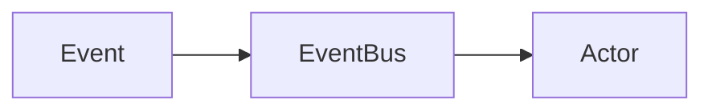

# Repo Documentation Hosting Strategy

## Table of Contents

1. [Current State of Docs](#1-current-state-of-docs)
2. [Goal: Maximum Automation](#2-goal-maximum-automation)
3. [Recommended Architecture](#3-recommended-architecture)
4. [Files to Add to the Repo](#4-files-to-add-to-the-repo)
5. [Mapping Existing Docs to Navigation](#5-mapping-existing-docs-to-navigation)
6. [Adding an Index Page](#6-adding-an-index-page)
7. [Configuration Details](#7-configuration-details)
8. [Automation Flow](#8-automation-flow)
9. [What "Automatic" Means in Practice](#9-what-automatic-means-in-practice)
10. [Optional Enhancements](#10-optional-enhancements)
11. [Files to Modify in the Repo](#11-files-to-modify-in-the-repo)
12. [Implementation Checklist](#12-implementation-checklist)

---

## 1. Current State of Docs

The repo already has a `docs/` directory with 7 Markdown files:

| File | Topic | Size |
|------|-------|------|
| `HOW_TO_USE_REMORA.md` | Practical usage guide | 19KB |
| `architecture.md` | System architecture | 8.7KB |
| `user-guide.md` | Getting started guide | 6.6KB |
| `externals-api.md` | Externals API reference | 10KB |
| `event-semantics.md` | Event types/semantics | 5.8KB |
| `virtual-agents.md` | Virtual agent guide | 5.5KB |
| `externals-contract.md` | Externals contract spec | 2.5KB |

These are well-structured Markdown files with tables of contents, headers, and code blocks. They are already in a format that Zensical can consume directly — **no conversion needed**.

## 2. Goal: Maximum Automation

The requirement is: *"When I update the docs, it should just automatically update the website."*

This means:
1. **No manual build step** — CI handles it
2. **No separate docs branch** — docs live alongside code on `main`
3. **No deploy commands** — push to `main` triggers deployment
4. **No content duplication** — the `docs/` folder IS the source of truth
5. **Docs evolve with code** — same PR, same commit, same review

## 3. Recommended Architecture

```
remora-v2/
├── .github/
│   └── workflows/
│       └── docs.yml          # NEW: GitHub Actions workflow
├── docs/
│   ├── index.md              # NEW: Landing page
│   ├── HOW_TO_USE_REMORA.md  # Existing
│   ├── architecture.md       # Existing
│   ├── user-guide.md         # Existing
│   ├── externals-api.md      # Existing
│   ├── event-semantics.md    # Existing
│   ├── virtual-agents.md     # Existing
│   └── externals-contract.md # Existing
├── zensical.toml             # NEW: Site configuration
└── ...
```

Only **3 new files** needed:
1. `zensical.toml` — configuration (at repo root)
2. `docs/index.md` — landing page
3. `.github/workflows/docs.yml` — CI workflow

No existing files need modification.

## 4. Files to Add to the Repo

### 4a. `zensical.toml`

```toml
[project]
site_name = "Remora"
site_url = "https://bullish-design.github.io/remora-v2/"
site_description = "Reactive agent substrate for code analysis and transformation"
repo_url = "https://github.com/Bullish-Design/remora-v2"
repo_name = "Bullish-Design/remora-v2"
edit_uri = "edit/main/docs/"
copyright = "Copyright &copy; 2026 Bullish Design"

nav = [
  { "Home" = "index.md" },
  { "User Guide" = "user-guide.md" },
  { "How to Use Remora" = "HOW_TO_USE_REMORA.md" },
  { "Architecture" = "architecture.md" },
  { "Concepts" = [
    "event-semantics.md",
    "virtual-agents.md",
  ]},
  { "API Reference" = [
    "externals-api.md",
    "externals-contract.md",
  ]},
  { "GitHub" = "https://github.com/Bullish-Design/remora-v2" },
]

[project.theme]
features = [
  "navigation.instant",
  "navigation.instant.prefetch",
  "navigation.tracking",
  "navigation.sections",
  "navigation.path",
  "navigation.top",
  "navigation.footer",
  "navigation.indexes",
  "content.code.copy",
  "content.code.annotate",
  "content.action.edit",
  "content.action.view",
  "search.highlight",
  "toc.follow",
]

[[project.theme.palette]]
media = "(prefers-color-scheme: light)"
scheme = "default"
toggle = { icon = "lucide/moon", name = "Switch to dark mode" }

[[project.theme.palette]]
media = "(prefers-color-scheme: dark)"
scheme = "slate"
toggle = { icon = "lucide/sun", name = "Switch to light mode" }

[project.theme.icon]
repo = "fontawesome/brands/github"
edit = "material/pencil"
view = "material/eye"
```

### 4b. `docs/index.md`

A landing page for the documentation site. This is the only new Markdown file needed. It should provide a brief overview of Remora and link to the existing docs.

### 4c. `.github/workflows/docs.yml`

```yaml
name: Documentation

on:
  push:
    branches:
      - main

permissions:
  contents: read
  pages: write
  id-token: write

jobs:
  deploy:
    environment:
      name: github-pages
      url: ${{ steps.deployment.outputs.page_url }}
    runs-on: ubuntu-latest
    steps:
      - uses: actions/configure-pages@v5
      - uses: actions/checkout@v5
      - uses: actions/setup-python@v5
        with:
          python-version: 3.x
      - run: pip install zensical
      - run: zensical build --clean
      - uses: actions/upload-pages-artifact@v4
        with:
          path: site
      - uses: actions/deploy-pages@v4
        id: deployment
```

## 5. Mapping Existing Docs to Navigation

The navigation structure groups the 7 existing docs into logical sections:

```
Home                    → docs/index.md (new)
User Guide              → docs/user-guide.md
How to Use Remora       → docs/HOW_TO_USE_REMORA.md
Architecture            → docs/architecture.md
Concepts/
  ├── Event Semantics   → docs/event-semantics.md
  └── Virtual Agents    → docs/virtual-agents.md
API Reference/
  ├── Externals API     → docs/externals-api.md
  └── Externals Contract→ docs/externals-contract.md
GitHub                  → external link
```

This grouping reflects the natural structure: user-facing guides at the top level, conceptual deep-dives in a section, API specs in another section.

## 6. Adding an Index Page

Zensical requires a `docs/index.md` as the site landing page. This should be a concise overview:

- What Remora is (1-2 sentences)
- Key capabilities
- Quick links to the most important docs
- Getting started pointer

This can be derived from existing content in `HOW_TO_USE_REMORA.md` and `user-guide.md` without duplicating them — just link to them.

## 7. Configuration Details

### docs_dir
Default is `"docs"`, which matches the existing directory. No configuration needed.

### site_url
Must be set to `https://bullish-design.github.io/remora-v2/` for:
- Instant navigation to work (relies on `sitemap.xml`)
- Correct canonical URLs in HTML head
- Proper social sharing metadata

### edit_uri
Set to `"edit/main/docs/"` so that each page has an "Edit on GitHub" button that links directly to the source file on the `main` branch.

### .gitignore
Add `site/` to `.gitignore` to prevent accidentally committing build output:
```
# Zensical build output
site/
```

## 8. Automation Flow

```
Developer edits docs/foo.md
        ↓
git commit + git push to main
        ↓
GitHub Actions triggers docs.yml
        ↓
zensical build --clean
        ↓
Upload site/ as Pages artifact
        ↓
Deploy to bullish-design.github.io/remora-v2/
        ↓
Website updated (typically < 2 minutes)
```

**Zero manual steps after initial setup.** Edit Markdown, push, done.

## 9. What "Automatic" Means in Practice

| Scenario | What happens |
|----------|-------------|
| Edit a doc and push to `main` | Site rebuilds and deploys automatically |
| Add a new `.md` file to `docs/` | Appears in site (add to `nav` in `zensical.toml` for explicit placement) |
| Delete a doc | Disappears from site on next build |
| Edit `zensical.toml` (nav, theme) | Site rebuilds with new config |
| Push to a feature branch | Nothing — only `main` triggers builds |
| Open a PR | Nothing — only merged pushes trigger |
| Rename a doc file | Update `nav` in `zensical.toml`, push, done |

### If you want even more automatic navigation
Remove the explicit `nav` from `zensical.toml` and Zensical will auto-infer navigation from the file tree. Trade-off: you lose control over ordering and grouping, but gain zero-config for new pages.

## 10. Optional Enhancements

### 10a. Path filtering (save CI minutes)
```yaml
on:
  push:
    branches: [main]
    paths:
      - 'docs/**'
      - 'zensical.toml'
```

### 10b. Manual rebuild trigger
```yaml
on:
  push:
    branches: [main]
  workflow_dispatch:
```

### 10c. Custom CSS
Create `docs/stylesheets/extra.css` and add to config:
```toml
[project]
extra_css = ["stylesheets/extra.css"]
```

### 10d. Mermaid diagrams
Zensical supports Mermaid natively via fenced code blocks:
````markdown

````

This could be valuable for architecture diagrams.

### 10e. Social cards
Auto-generated Open Graph images for link previews (may require additional theme features).

### 10f. Search customization
The built-in search works out of the box. No additional configuration needed.

## 11. Files to Modify in the Repo

| File | Change |
|------|--------|
| `.gitignore` | Add `site/` entry |

That's it. No existing files need modification beyond `.gitignore`.

## 12. Implementation Checklist

1. [ ] Create `zensical.toml` at repo root
2. [ ] Create `docs/index.md` landing page
3. [ ] Create `.github/workflows/docs.yml`
4. [ ] Add `site/` to `.gitignore`
5. [ ] Go to GitHub repo **Settings → Pages → Source → GitHub Actions**
6. [ ] Push to `main`
7. [ ] Verify site at `https://bullish-design.github.io/remora-v2/`
8. [ ] Verify "Edit on GitHub" buttons work
9. [ ] Verify search works
10. [ ] Verify dark/light mode toggle works

---

*Sources*:
- [Zensical — Publish Your Site](https://zensical.org/docs/publish-your-site/)
- [Zensical — Create Your Site](https://zensical.org/docs/create-your-site/)
- [Zensical — Navigation Setup](https://zensical.org/docs/setup/navigation/)
- [Zensical — Repository Setup](https://zensical.org/docs/setup/repository/)
